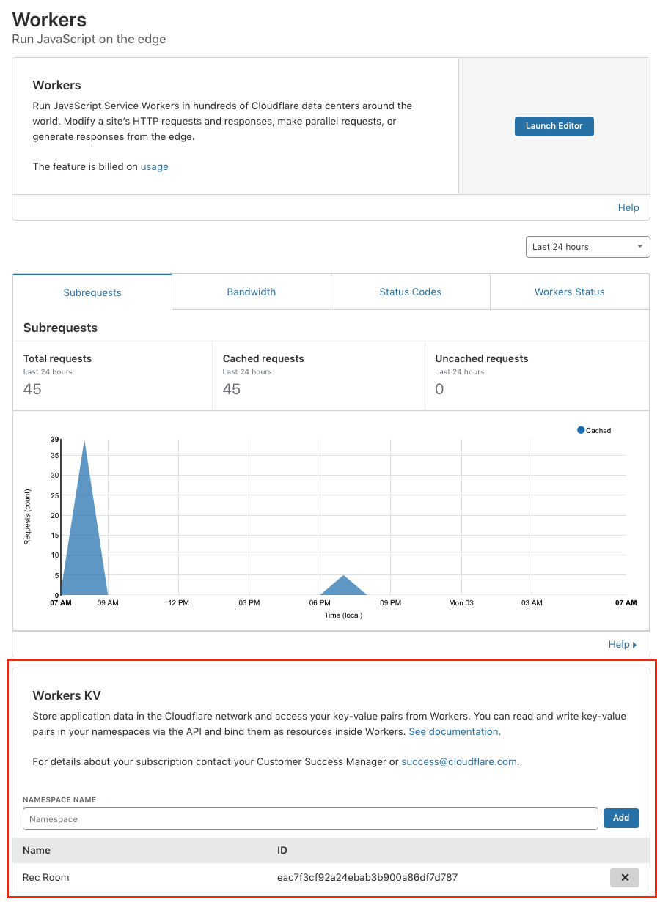
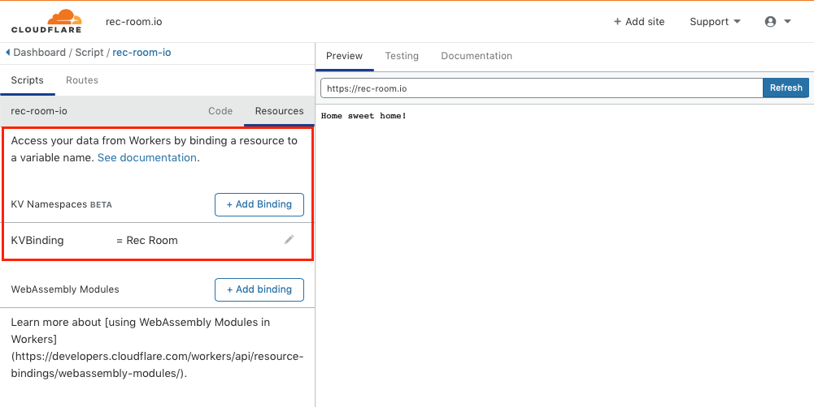
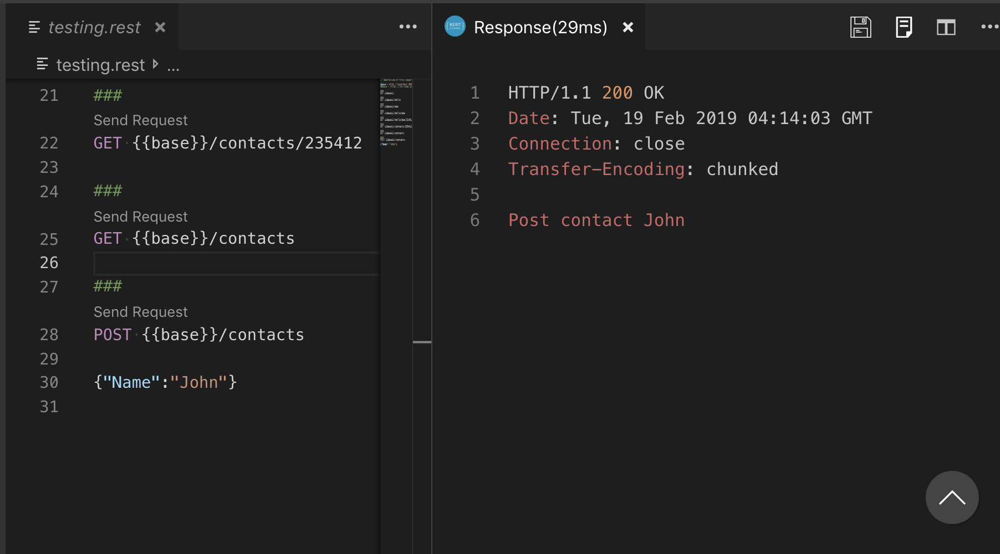

# Work in Progress
This branch will
1. Remove the dependance on "cloudflare-workers-webpack-plugin": "^2.0.4" using the Cloudflare tool "Wrangler" instead
2. Update to the latest version of the the Fable/Bable/Webpack tools
3. Update the documentation to note the need to install and configure Wrangler
4. Update the documentation to use `wrangler publish` rather than the prior `yarn env.....`
5. Document deploying to the free *.workers.dev environment so there is no need to sign up for a paid account https://www.cloudflare.com/en-ca/products/cloudflare-workers/


# Cloudflare Workers in FSharp - II
This is the second of several posts exploring FSharp servicing HTTP requests using the Cloudflare Workers infrastructure. Building on ["Hello World"](https://github.com/jbeeko/cfworker-hello-world), this post will show how to create a web API with routing, explore the Worker KVStore and provide tooling for dead simple **edit -> save -> deploy** workflow. It then puts that all together to create a Contact REST API. Finally a bit of benchmarking shows performance is still excellent.

[**Skip this, take me to the hands on part.**](#tooling-and-workflow)

## Worker Recap
As described in the first post, Cloudflare workers are "functions as a service". But rather than starting a VM or a container to run functions, workers are run in [Chrome V8 isolates](https://v8.dev/docs/embed) via the [`ServiceWorker`](https://developer.mozilla.org/en-US/docs/Web/API/Service_Worker_API) API. The are written in JavaScript, any language that compiles to JavaScript or any language that compiles to [WASM](https://webassembly.org). [This post](https://blog.cloudflare.com/cloud-computing-without-containers/) is a good introduction to workers.

 ## Refactoring the Worker
In the first post the entire F# worker was in one file Worker.js at the project root:
```
// 1. Module and import declarations
module Worker
open Fable.Core
open Fable.Import.Browser
open Fable.Import.JS

// 2. JS interop statements
[<Emit("addEventListener('fetch', $0)")>]
let addEventListener (e:FetchEvent->Promise<Response>) : unit = jsNative

[<Emit("new Response($0, {status: $1})")>]
let newResponse (a:string) (b:string) : Response = jsNative

// 3. The worker code
// Define a request handler which creates an an appropreate Response
// and returns a Promise<Response>
let private handleRequest (req:Request) =
    promise {
        let txt = sprintf "Hello from the F# World at: %A" System.DateTime.Now
        return newResponse txt "200"}

// Register a listner for the ServiceWorker 'fetch' event. That listner
// will extract the request and dispath it to the request handler.
addEventListener (fun (e:FetchEvent) ->
    e.respondWith (U2.Case1 (handleRequest e.request)))
```

That is a bit messy. Lets split the worker into several files:
- `src/Worker.fs`- the routing logic and entry point
- `src/Stats.fs` and `src/Contacts.fs` - Files for specific handlers or sub-apps. For example `Contacts.fs` manages a Contact API.
- `src/WorkerInterop.fs`- interop / utility functions

### Worker.fs
Like before this adds a listener for fetch events and then dispatches the request The key line is:
`App.routeRequest (verb req) (path req) req`

This calls `routeRequest` with three parameters, the HTTP verb, the path and the request itself.

```
module Worker
open Fable.Core
open Fable.Import.Browser
open WorkersInterop
open System

// Request router written as a match statement on the
// HTTP Verb and the route. It handles multi-part routes,
// route variables, and subroutes.
let rec private routeRequest verb path req =
  match (verb, path) with
  | GET, [] ->                  textResponse "Home sweet home!"
  | GET, ["hello"] ->           textResponse (sprintf "Hello world from F# at: %A" DateTime.Now)
  | GET, ["bye"] ->             textResponse "Goodbye cruel world."
  | GET, ["hello"; "bye"] ->    textResponse "I say hello and the goodbye."
  | GET, ["hello"; "bye"; i] -> textResponse (sprintf "Hello-bye id: %s" i)
  | GET, ["stats"] ->           Stats.stats req
  | _, "contacts"::subPath ->   Contacts.routeRequest verb subPath req
  // Other routes
  | _,_ ->                      noHandler req
and private noHandler req =
  newResponse (sprintf "No handler for: %s on: %s" req.method req.url ) "404" |> wrap

// Dispatch to the web App wich will generate a
// Response and return it as a Promise<Response>
let private handleRequest (req:CFWRequest) =
    routeRequest (verb req) (path req) req

// Register a listner for the ServiceWorker 'fetch' event
addEventListener (fun (e:FetchEvent) ->
  e.respondWith (U2.Case1 (handleRequest (e.request :?> CFWRequest))))

```
#### A few comments on routing
The router is implemented as a pattern match statement on the HTTP verb and the path. This approach is lifted from the ReasonML router ["pattern match your way to glory"](https://reasonml.github.io/reason-react/docs/en/router.html#match-a-route). One thing that stands out is how simple and approachable this code is. Given a HTTP verb and a path represented as a collection of strings we pattern match. But despite this simplicity it is quite powerful.

**Paths can be any length**- and any segment of it may be "wild carded" using `_`.

**Path parameters**- Pattern matching makes it easy to extract one or more path parameters. For example:

`| GET, ["hello"; "bye"; i] -> helloByeId req i`

extracts the last element of the path as an id passing it as a parameter to `helloByeId`. It would be just easy to extract an internal path element or several elements.

**Sub-apps are trivial**- Creating and routing to stand-along sub-applications is trivial. For example:

`| _, "contacts"::subPath -> Contacts.routeRequest verb subPath req`

uses pattern matching on a list to determine the sub-app Contacts should be routed to. Contacts implements the same `routeRequest` signature and is invoked with the tail of the path. By using something like `"contacts"::"address"::subPath` you could match deeper than the first sub-path.

**Each handler returns a promise**- So why does each handler not return a Response and let the Worker put it in a promise just before returning to the event? The reason for this is that the `body` member of request is a promise. This can only be extracted from in a promise via `let!` but the return from this will be a promise. So any handler that needs access to the body will be returning a promise, so to keep it consistent they all do.

**Why not use combinators for routing?**- [Suave.io](https://suave.io/) and [Giraffe.io](https://github.com/giraffe-fsharp/Giraffe), two recent functional first web frameworks both use combinators and functional composition to build routers. Here is a router from the Giraffe documentation:
```
choose [
    GET >>=
        choose [
            route "/"     >>= setBodyAsString "Index"
            route "/ping" >>= setBodyAsString "pong"
        ]
    POST >>=
        choose [
            route "/submit" >>= setBodyAsString "Submitted!"
            route "/upload" >>= setBodyAsString "Uploaded!"
        ]
]
```
In its shape this looks a bit similar the match statement, sort of like a set of nested match statements with `choose` taking the place of `match ... with`. But the implementation is completely different. `GET`, `route` and `setBodyAsString` are HttpHandler functions which take a `HTTPContext` parameter (wrapping the request and response) and return a `HttpContext option`. These functions are composed into chains of one or more handlers using `>>=`. As long as the return value remains `Some context` the combinator `>>=` applies the next function in the composition chain. As soon as `None` is returned the remaining functions in the  chain are skipped and `None` is returned.

`choose` is a combinator that takes a list of handler chains and returns either the result of the first chain that evaluates to `Some context` or `None` if there is no such chain.

The power of combinators is that each handler returns a new `HttpContext` and can rewrite both its request and  response records for use by the next handler. For example some handlers might do nothing but add headers to requests or post processing responses into PDF (e.g. `route "/ping" >>= setBodyAsString "pong" >>= toPdf`). For a better explanation see [this](https://dusted.codes/functional-aspnet-core). The disadvantage is that it requires a combinator library and can appear a bit "magic" to newcomers. The match statement is very obvious, suscinct and took only minutes to write.

**Match on Tuples or Records?** The match statement is given the tuple `(verb, path)` to match on. If the API needed to match on an `AccessLevel` in only one case,  all cases of the match statement would need to be re-written.

But if rather than matching on a tuple the statement matched on a record then each case could match on any combination of the records fields in ay order. Missing fields are considered to be like a `_` in the tuple case. Here is what this would look like:
```
// Define a route spec
type RouteSpec = {
        mth: string
        pth: string list
}

// and a router that routes based on a spec
match req with
| {mth="GET"} -> req2.pth
| {pth = ("contacts"::subpath)} -> subpath
| _ -> ["fail"]
```
Then if `req` is `{mth = "GET"; pth = ["contacts"; "44"]}` the router will return `["contacts"; "44"]` but if it is `{mth = "POST"; pth = ["contacts"; "44"]}` then the router will return `["44"]`.

We could now redefine `RouteSpec` as:
```
type RouteSpec = {
        mth: string
        pth: string list
        auth: AccessLevel
}
```
and route by matching on `auth` where needed without breaking any code. The disadvantage is that the router does not look as clean and simple.

## Contact CRUD Operations
Cloudflare Workers support a data store called [Workers KV](https://developers.cloudflare.com/workers/kv/). This is a globally distributed highly read-biased, eventually consistent key-value store. Key parameters are:
* 100,000 key reads per second
* 1 write per second
* global write and delete propagation within 10 seconds
* 512 byte key size
* 2 meg value size
* billions of keys/namespace
* 20 namespaces/account
* keys can be set to automatically expire and garbage collect

### Configuring Workers KV
There is a [REST API](https://developers.cloudflare.com/workers/kv/api/) for managing all things KV, but initially it is simplest to login-to Cloudflare and use the portal. The first step is to add a `Namespace` to your account. This effectively creates a key-value store with the given name. In this case I've created the namespace `Rec Room`.



To access the store from a workers the `Namespace` needs to be bound to a value accessible within the Worker code. This can be done on the Workers editor. Here I am binding `Rec Room` to `KVBinding`.



Once the names space has been bound like this there will be a three member API available to the Worker Javascript:
* `KVBinding.put(key, value)`
* `KVBinding.get(key)`
* `KVBinding.delete(key)`

The `WorkersInterop.fs` file exposes this API using the following `Emit` statements.
```
[<Emit("KVBinding.get($0)")>]
let kvGet(key:string) : Promise<string option> = jsNative

[<Emit("KVBinding.put($0,$1)")>]
let kvPut(key:string) (value:string) : Promise<unit> = jsNative

[<Emit("KVBinding.delete($0)")>]
let kvDelete(key:string) : Promise<unit> = jsNative
```
This works find, but note that the namespace binding is hard-coded to `KVBinding` so you will need to use the same or change this file.

> NOTE: In addition to those basics the API supports a few options such as key expiration and typed values.

### Using the Workers KV
Usage to of the API could not be simpler. `Contacts.fs` implements a tiny web api that supports 'POST, GET, PUT and DELETE` of a contact record.

`GET` is as simple as:
```
getContact req i =
    promise {
        let! getRes = kvGet i
        match getRes with
        | None -> return newResponse (sprintf "No contact with id %s" i) "404"
        | Some json -> return newResponse json "200"
    }
```

`POST` is almost as simple:
```
postContact req  =
    promise {
         let! body = (req.text())
         let contact = Decode.fromString contactDecoder body
         match contact with
         | Ok c ->
            do! kvPut c.id body
            return newResponse body "200"
         | Error e -> return newResponse (sprintf "Unable to process: %s because: %O" body e) "200"
    }
```

> NOTE: I've only used the Worker KV store with a deployment to Cloudflare itself and not with the Cloudworker local emulator.

## Deploying To Cloudfare from CLI
Part I [demonstrated](https://github.com/jbeeko/cfworker-hello-world/#deploying-manually) deploying a worker by pasting the JavaScript into an online editor. That works but better is deploying as part of a build process. Cloudflare offers 3 [options](https://developers.cloudflare.com/workers/deploying-workers/):
* a Cloudflare HTTP API
* the serverless framework
* Terraform.

The Terraform and serverless framework seem quite heavy for simple scenarios. The raw Cloudflare looks like it would be a chunk of work to integrate into the existing work flow.

Fortunately there is the excellent [cloudflare-worker-webpack-plugin](https://www.npmjs.com/package/cloudflare-worker-webpack-plugin) which does the hard work of integrating to the CF API and exposes that as a WebPack plugin. All we need to do is add a configuration section to our existing webpack.config.js and then this command:

`yarn webpack --env.CF_KEY=$CF_KEY --env.CF_EMAIL=$CF_EMAIL`

This will connect to Cloudflare, remove any existing routes, create routes and upload the `Workers.bndl.js` as the worker to run on the routes specified.

 The plugin configuration looks like this:
```
new CloudflareWorkerPlugin(
    // CF credentials for instructions on where to find them see:
    // https://developers.cloudflare.com/workers/api/
    env.CF_EMAIL,
    env.CF_KEY,
    {   // Options object, for addtional options see:
        // https://www.npmjs.com/package/cloudflare-worker-webpack-plugin
        site: `rec-room.io`,
        enabledPatterns: `rec-room.io/*`,
        clearRoutes: true,
        verbose: true,
        colors: true,
        enabled: env.prod,
        script: "worker.bndl.js"})
```

Most of the configuration values are as you would expect: the routes, the site etc. A bit obscure are the two lines:
```
env.CF_EMAIL,
env.CF_KEY,
```

These are used to provide the `CLOUDFLARE_AUTH_EMAIL` and the `CLOUDFLARE_AUTH_KEY` respectively. This is done by using the WebPack [environment variables feature](https://webpack.js.org/guides/environment-variables/). The actual values can be provided on the command line directly or pulled from a user environment. In the command line show those values are defined in the `.bash_profile` file.

> **NOTE:** Currently you can only deploy a worker to a domain you own that you have moved to Cloudflare. However you will soon be able to host worker on a subdomain of `workers.com`. So go read about it and [claim your workers.com domain now](https://blog.cloudflare.com/announcing-workers-dev/).

> NOTE: The `cloudworker` local emulator can be configured to support Worker KV. However the CLI deployment works so well and is so fast that I've not bothered.

### Debugging Workers
Debugging support for Workers can be a bit tricky. If the `worker.bndl.js` file is deployed manually as [described](https://github.com/jbeeko/cfworker-hello-world#deploying-manually) here, the portal will show the JS console messages. But if deployed to Cloudflare environment then errors in the worker will result in a generic page with no debugging information. Various tips and tricks are discussed [here.](https://developers.cloudflare.com/workers/writing-workers/debugging-tips/)

## Protecting your API
There are three approaches to protecting your API from abuse:

**Add Rate Limiting:** You can enable rate limiting for your domain. In this case you will not be charged for the first 10,000 _unblocked_ requests. After that you will be charged %0.05/10,000 successful requests, or $5.00/1,000,000. Make sure you set the rate low enough or you may pay more this way than by leaving the API open.

**Use Cloudflare Access:** You can sign up for Cloudflare Access. This will let you protect your API with a [Service Token](https://developers.cloudflare.com/access/connecting-to-apps/service-token/). Cloudflare Access is a paid service but 5 users with GitHub as the Auth provider seems to be free.

**Don't Worry About It:** Worker invocations cost $5.00/10million. You may decide if someone performs 100million requests you will just pay the $50.00. Enterprise users probably pay even less.


## Scaling and Performance
The simple "Hello World" worker described in part one had excellent performance. Out of the box it was able to serve about 5000 requests/sec with an average response time of 17ms.

Querying the more realistic `/contacts` api with the command `ab -k -n 1000000 -c 100 https://rec-room.io/contacts/12` resulted in 1 million requests with a concurrency of 100. These were completed in 385 seconds at a rate of about 2594/requests per second. The mean response time was 38ms. Still very good.
```
$ ab -k -n 1000000 -c 100 https://rec-room.io/contacts/12
This is ApacheBench, Version 2.3 <$Revision: 1826891 $>
...
Server Software:        cloudflare
Server Hostname:        rec-room.io
Server Port:            443
SSL/TLS Protocol:       TLSv1.2,ECDHE-ECDSA-CHACHA20-POLY1305,256,256
TLS Server Name:        rec-room.io

Document Path:          /contacts/12
Document Length:        104 bytes

Concurrency Level:      100
Time taken for tests:   385.396 seconds
Complete requests:      1000000
Failed requests:        0
Keep-Alive requests:    999049
Total transferred:      536995245 bytes
HTML transferred:       104000000 bytes
Requests per second:    2594.73 [#/sec] (mean)
Time per request:       38.540 [ms] (mean)
Time per request:       0.385 [ms] (mean, across all concurrent requests)
Transfer rate:          1360.70 [Kbytes/sec] received

Connection Times (ms)
              min  mean[+/-sd] median   max
Connect:        0    0   3.9      0    1259
Processing:    17   38  34.8     30    7702
Waiting:       16   38  34.8     30    7702
Total:         17   38  35.1     30    7702

Percentage of the requests served within a certain time (ms)
  50%     30
  66%     35
  75%     39
  80%     42
  90%     55
  95%     77
  98%    136
  99%    185
 100%   7702 (longest request)
 ```

>NOTE: Rate limiting is enabled across `rec-room.io`. If you wish to explore performance you will need to sign up for an account and deploy to it.


## Tooling and Workflow
The repository [https://github.com/jbeeko/cfworker-web-api](https://github.com/jbeeko/cfworker-web-api) will let you replicate the Hello World worker change it and build a modified version.

### Prerequisites
This repository was developed under OSX. But you should be able to use Windows, OSX or Linux. The following tooling is assume to be installed before you clone the repository:
* dotnetcore 2.1 - [see](https://dotnet.microsoft.com/download/dotnet-core/2.1)
* FSharp - [see](https://fsharp.org/guides/mac-linux-cross-platform/). Note on OSX/Linux you will also need Mono- [see](https://www.mono-project.com/download/stable/#download-mac) or via Homebrew.
* An FSharp editor - I recommend [VSCode](https://code.visualstudio.com/download) with the [Ionide](https://marketplace.visualstudio.com/items?itemName=Ionide.Ionide-fsharp) extension. But MS VisualStudio, JetBrains Rider or a number of others should work.
* Node and Node Package Manager - [see](https://nodejs.org/en/download/) or via Homebrew
* Yarn - [see](https://www.npmjs.com/package/yarn) or via Homebrew
* cloudworker - [see](https://github.com/dollarshaveclub/cloudworker). Install it globally with `npm -g install @dollarshaveclub/cloudworker`. **NOTE:** this would not install for me on widows. `npm` was not able to find `python`. A suggestion to do this: `npm --add-python-to-path='true' --debug install --global windows-build-tools` did not help.
* **REST Client** - [see](https://marketplace.visualstudio.com/items?itemName=humao.rest-client). With this installed you can open `testing.rest` and execute the test HTTP requests in the file. This is very nice to have for those using VSCode.

With the exception of the REST Client VSCode extension these are the same pre-requisites as required by Part I.

### Building and Running

**Clone**- the repository with: `git clone https://github.com/jbeeko/cfworker-web-api`

**Install**- dependancies and node modules with: `yarn install`

**Build and deploy to Cloudflare** - at any time build and deploy with:

`yarn webpack --env.CF_KEY=<your CF key> --env.CF_EMAIL=<your CF email>`

Assuming you have a Worker enabled Cloudflare account his will connect to Cloudflare, remove any existing routes, create routes and upload the `Workers.bndl.js` as the worker to run on the routes specified. There is no need to pre-configure workers in anyway.

If successful the terminal will show the following:
```
...
Looking up zone-id for 'rec-room.io'
Found! Zone-id for 'rec-room.io' is: c8e798e74ccfa6d1721483909288be0a
Uploading worker...
Success! Cloudflare worker deployed
Removing existing routes: rec-room.io/*
...
```
The worker is now live on the routes defined in the `webpack.config.js` file. Notice that that the deploy step is only a second or so. In fact this is so good I've given up deploying to the local cloud worker emulator.

**Build and deploy locally**- after edits with: `yarn webpack`. In the terminal you will see:
```
yarn run v1.13.0
$ /Users/jbeeko/cfworker-hello-world/node_modules/.bin/webpack
fable-compiler 2.1.12
...
bunch of build messages suppresed here
...
✨  Done in 13.75s.
```

And in the cloudworker terminal window you will see the local worker has detected the new `Worker.bndl.js` file and reloaded:
```
Changes to the worker script detected - reloading...
Successfully reloaded!
```
> NOTE - the cloudworker will support the Worker KV but additional configuration work is needed.


**Test**- If the VSCode REST Client extension is installed you can test the API by opening testing.rest. That file contains a series of http requests. They can be executed by clicking on the 'Send Request' hover link. If VSCode is not available use cURL PostMan or any other API test tool.




## Summary
This installment started by refactoring the worker from Part I into multiple files. It then added a router based on FSharp match statements. Several different routing patterns were added as examples to show the flexibility of the approach. A Contact sub-app was created that takes a JSON post body to perform CURD operations on Contacts. Finally we added some support tooling for automated deployment of workers.


## Resources
[See the first post.](https://github.com/jbeeko/cfworker-hello-world/#resources)
[Worker KV](https://developers.cloudflare.com/workers/kv/)
[Deployment webpack plugin](https://www.npmjs.com/package/cloudflare-worker-webpack-plugin)


